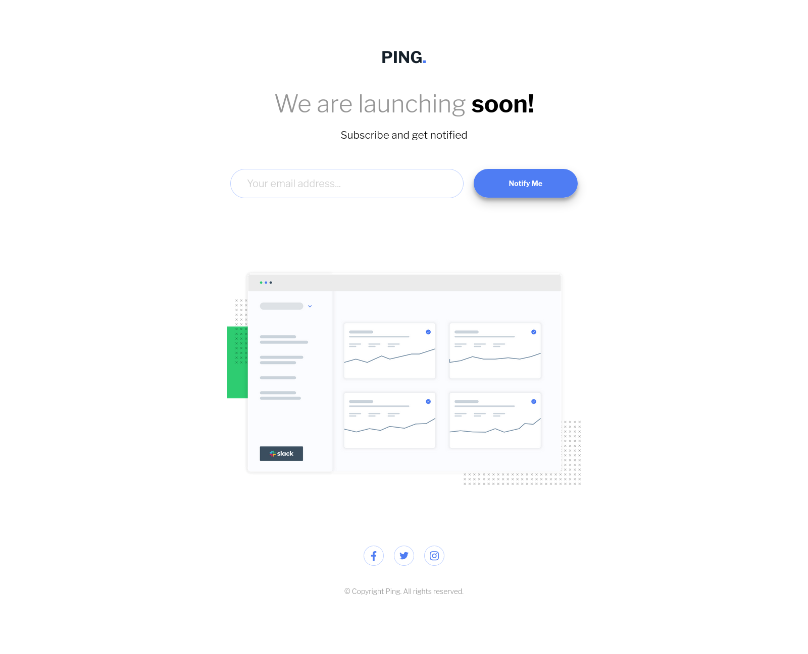
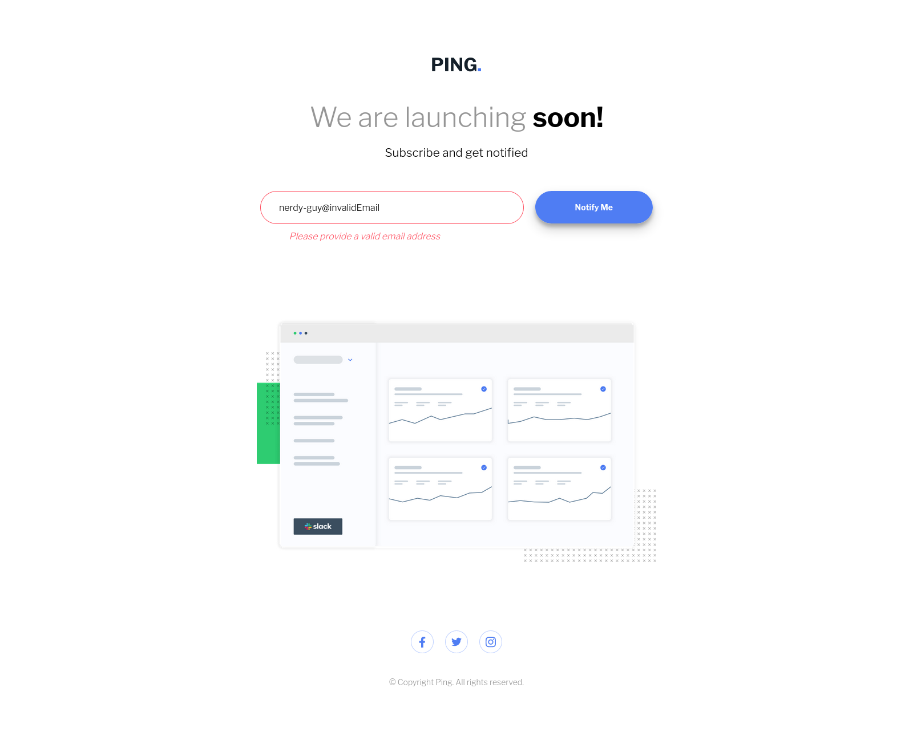

# Frontend Mentor - Ping coming soon page solution

This is a solution to the [Ping coming soon page challenge on Frontend Mentor](https://www.frontendmentor.io/challenges/ping-single-column-coming-soon-page-5cadd051fec04111f7b848da).

## Table of contents

- [Overview](#overview)
  - [The challenge](#the-challenge)
  - [Screenshot](#screenshot)
  - [Links](#links)
- [Built with](#built-with)
- [Project structure](#project-structure)

## Overview

### The challenge

Users should be able to:

- View the optimal layout for the site depending on their device's screen size
- See hover states for all interactive elements on the page
- Submit their email address using an `input` field
- Receive an error message when the `form` is submitted if:
  - The `input` field is empty. The message for this error should say _"Whoops! It looks like you forgot to add your email"_
  - The email address is not formatted correctly (i.e. a correct email address should have this structure: `name@host.tld`). The message for this error should say _"Please provide a valid email address"_

### Screenshot




### Links

- [Solution](https://github.com/nerdy-guy/ping-coming-soon-page)
- [Live Site](https://nerdy-guy.github.io/ping-coming-soon-page/)

## Built with

- Semantic HTML5 markup
- CSS custom properties
- Flexbox
- CSS Grid
- Mobile-first workflow
- JavaScript DOM manipulation

## Project structure

```
ping-coming-soon-page
├── app.js
├── images
│   ├── favicon-32x32.png
│   ├── illustration-dashboard.png
│   └── logo.svg
├── index.html
├── invalidInput.png
├── README.md
├── style.css
└── validInput.png
```
